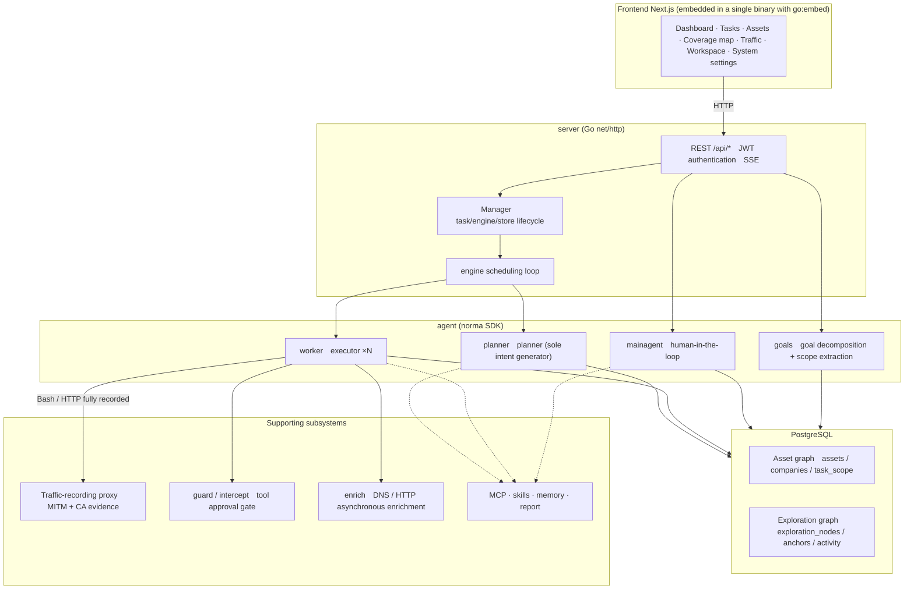
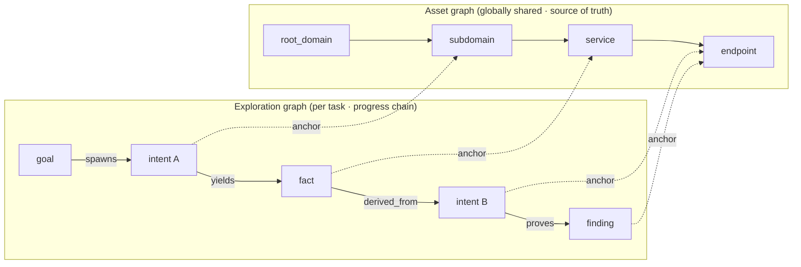
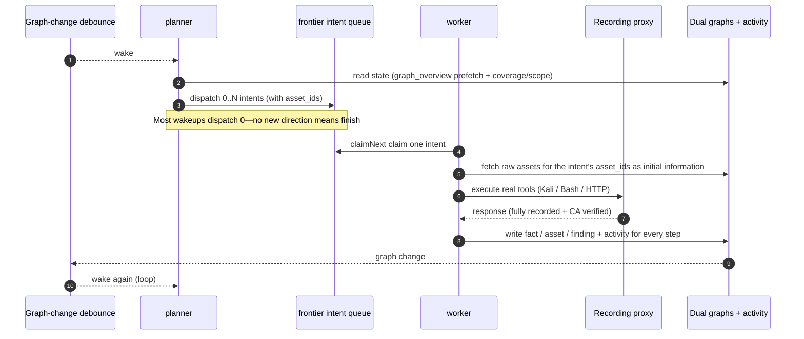
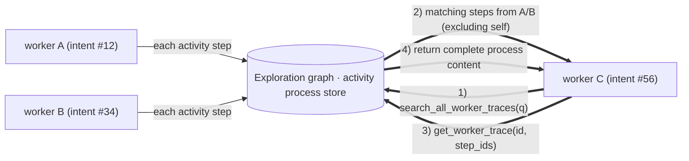
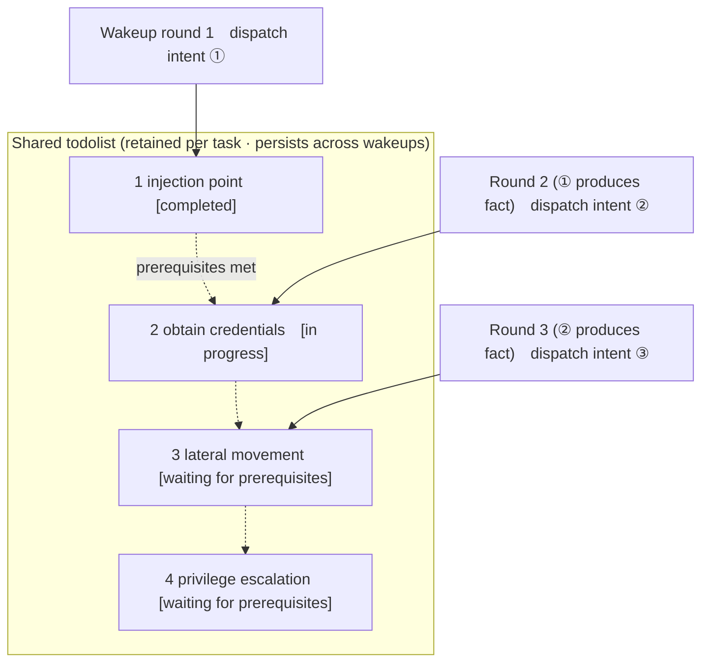

[Chinese](README.md) | [English](README.en.md) | [Korean](README.ko.md)

<div align="center">

# ARTEX

AI Autonomous Penetration Testing System (Go backend + Next.js frontend)

🌐 **Online Demo**: [https://artex-demo.vercel.app/](https://artex-demo.vercel.app/)

</div>

> Internal deployment material: [Documentation index](docs/README.en.md) · [Architecture](docs/architecture.en.md) · [Security and backdoor review](docs/security-review.en.md)

---

## Screenshots

> See the [online Demo](https://artex-demo.vercel.app/) for the complete interaction flow.

| Dashboard (overview / token usage / activity stream) | Task list |
| :---: | :---: |
|  |  |

| Task · execution process (sessions / tool calls) | Exploration graph |
| :---: | :---: |
|  |  |

| Findings | Assets |
| :---: | :---: |
|  |  |

| Asset coverage map (force-directed layout · tested highlights · collapsible nodes) |
| :---: |
|  |

| Traffic recording | Human-in-the-loop conversation |
| :---: | :---: |
|  |  |

| Agent management | LLM configuration |
| :---: | :---: |
|  |  |

| Interception approval | Backend logs |
| :---: | :---: |
|  |  |

---

## Approval Record Details

Global **Approval Records**, task-level **Interception Approval**, and approval cards in conversations can all be expanded to view details. The display structure follows the [approval detail component in AegisHook](https://github.com/RuoJi6/AegisHook/blob/main/web/src/components/CallDetail.vue), while retaining ARTEX's components and theme.

## Asset Synchronization (ScopeSentry)

You can synchronize asset data directly from [ScopeSentry](https://github.com/Autumn-27/ScopeSentry), avoiding duplicate collection:

- Enter the ScopeSentry address and API key on the **Asset Synchronization** page to connect the data source.
- Select targets and asset types to synchronize by **project** or **task** (domain / subdomain / IP / port / site / endpoint, and more).
- Import with one click and consolidate assets by company scope, then send them directly to ARTEX's asset graph for agent exploration.

---

## Installation

> Requires **PostgreSQL**; exploration requires an **LLM** (`ANTHROPIC_API_KEY` or `OPENAI_API_KEY`, which can also be configured in the UI).

### Method 1: One-click installation script (recommended)

```bash
git clone https://github.com/Autumn-27/ARTEX.git
cd ARTEX
./install.sh
```

The script checks Docker (if it is missing, it links to the official installation guide and does not execute a remote installer), then lets you choose **① all Docker** or **② local compilation and execution**:

- **① All Docker**: Enter a Postgres password (press Enter for a random password) → automatically write `.env` → `docker compose up -d`.
- **② Local execution**: Choose a database (connect to an existing one / start one with Docker) → generate `config.json` → compile the embedded single binary with `go` → start it.

After installation, open **http://localhost:8787**. Set the administrator password at `/setup` on first access.

### Method 2: Docker Compose (manual)

```bash
git clone https://github.com/Autumn-27/ARTEX.git
cd ARTEX
cp .env.example .env          # fill in POSTGRES_PASSWORD; optionally set ANTHROPIC_API_KEY
docker compose up -d          # pull the autumn27/artex image + postgres
# → http://localhost:8787
```

The image includes common tools (ripgrep/curl/vim/npm/nmap, and more); `./skills`, `./data`, and the JWT-key directory `./state` are persisted through bind mounts.

For remote MCP, select `http` (Streamable HTTP) or `sse` (legacy SSE) in system settings.
Legacy SSE services usually establish the event stream with `GET /sse` and receive JSON-RPC requests through the returned
`/message?sessionId=...`. When configuring it, set the URL to `/sse` and set the request header to
`Authorization=Bearer <token>`.

### Method 3: Download a prebuilt binary (Releases)

Download the zip for your platform from [Releases](https://github.com/Autumn-27/ARTEX/releases) and extract `artex` + `start.sh` (`start.bat` on Windows) + `skills/` + `config.example.json`:

```bash
cp config.example.json config.json   # fill in the database connection
./start.sh                           # → http://localhost:8787
```

> Start with `start.sh` / `start.bat` instead of running `./artex` directly. It is a watchdog script: after the program exits, it decides whether to restart it based on the exit code, and **the [one-click page update](#method-1-one-click-page-update-recommended) relies on it to complete the replacement**. If you run `./artex` directly, it will not be relaunched after an update.
> To keep it running in the background: `nohup ./start.sh >artex.log 2>&1 &`.

### Method 4: Build a single binary from source

```bash
# 1) Export the frontend statically
cd web && npm ci && npm run build:static && cd ..
# 2) Copy it into the embedded directory
cp -r web/out server/webui/dist
# 3) Build (-tags embedui embeds the frontend)
CGO_ENABLED=0 go build -tags embedui -o artex ./cmd/artex
./start.sh
```

### Method 5: Build cross-platform Release archives

`build.sh` first builds and embeds the frontend, then uses the Go linker to strip debug information and compresses the release files into zip archives. Release mode generates zip packages for Linux amd64/arm64, macOS amd64/arm64, and Windows amd64 by default:

```bash
./build.sh --release
# Artifacts: dist/artex-0.3.3-*.zip
```

UPX self-extracting binaries may be incompatible with some Linux kernels, virtualization environments, or security policies, so UPX is disabled by default. Use `ARTEX_TARGETS` to customize targets; when you have confirmed compatibility with the target environment, pass `--upx` explicitly to reduce the binary size further:

```bash
ARTEX_TARGETS=linux/amd64,windows/amd64 ./build.sh --release
./build.sh --target linux/amd64 --upx
```

---

## Updating and Upgrading

> Upgrades replace only the program and do not touch data: the Postgres data volume `pgdata`, `./data` (workspace / SQLite, etc.), `./state` (JWT key), and `./skills` are preserved. **You do not need to run database migrations manually**—each time `artex` starts, it reruns `schema.sql` idempotently (including `ADD COLUMN` / `CREATE INDEX IF NOT EXISTS`), so restarting performs the migration. Back up `./data`, `./state`, and the database before upgrading anyway.

<a id="method-1-one-click-page-update-recommended"></a>
### Method 1: One-click page update (recommended)

On the **System Configuration** page (sidebar **System Configuration** → `/system/settings`), the **Version and Updates** card can check for and install a new version directly, without logging in to the server.

After you click **Update**, the system downloads the release package for the current platform → compares its `SHA256SUMS` with the Release → smoke-tests the new binary with `-h` → stages it as `artex.new` → exits, then `start.sh` / `start.bat` relaunches the program and completes the replacement. The page automatically refreshes after the new version is online.

- **A failure does not leave a broken program**: if verification or the smoke test fails, the staged file is discarded and the current version continues running; if the newly installed version fails to start three times in a row, it automatically rolls back to `artex.old` (the failed version is kept as `artex.failed` for troubleshooting).
- **Rollback is always available**: the previous version is kept as `artex.old`, and the card includes **Rollback to previous version**. Database schemas do not roll back.
- **Updates interrupt running tasks**—an update restarts the program, so perform it while idle.
- **Development builds cannot be updated**: updates are disabled when the version is `dev` or `git describe` has a suffix, preventing a release from overwriting a local debug binary.
- **Docker replaces only the program, not the image**: tools such as Playwright and nmap in the image are not upgraded, and rebuilding the container with `docker compose up -d` returns to the version bundled in the image. To upgrade the image as well, run `docker compose pull artex && docker compose up -d artex`.
- If GitHub requires a proxy, configure the **global proxy** on the same page; the update path uses it. Updates download only from the GitHub domain and enforce HTTPS.

### Method 2: One-click update script

```bash
cd ARTEX
./update.sh
```

The script optionally runs `git pull` to fetch the latest code, then lets you choose **① Docker update** or **② local compilation update** (corresponding to `install.sh`):

- **① Docker**: Specify a target image tag (press Enter to reuse `.env`'s `ARTEX_TAG`; the current template defaults to `v0.3.15`) → `docker compose pull` → `docker compose up -d` (the new image restarts and automatically migrates the schema).
- **② Local**: Rebuild the frontend's static artifacts → recompile `./artex` (the process takes effect after restarting).

### Method 3: Docker Compose (manual)

```bash
cd ARTEX
git pull                       # update compose / scripts (optional)
# Specify a version: set ARTEX_TAG=v0.3.15 in .env; otherwise Compose uses its pinned version
docker compose pull artex
docker compose up -d artex     # replace the image and restart → automatically migrate schema
docker image prune -f          # clean up old images (optional)
```

### Method 4: Prebuilt binary (Releases)

Download the new version's zip from [Releases](https://github.com/Autumn-27/ARTEX/releases), stop the old process, then overwrite `artex` and `skills/` (preserve your `config.json` and `data/`) and restart:

```bash
cp -r <extracted-directory>/skills ./ && cp <extracted-directory>/artex ./
./start.sh
```

### Method 5: Build from source

```bash
git pull
cd web && npm ci && npm run build:static && cd ..
cp -r web/out server/webui/dist
CGO_ENABLED=0 go build -tags embedui -o artex ./cmd/artex
# Restart ./start.sh
```

---

## Configuration

**Database** (`config.json`, or overridden with the `ARTEX_PG_DSN` environment variable):

```json
{
  "database": {
    "host": "127.0.0.1", "port": 5432,
    "user": "artex", "password": "yourpass",
    "dbname": "artex", "sslmode": "disable"
  }
}
```

**LLM**: `export ANTHROPIC_API_KEY=sk-...` (or `OPENAI_API_KEY`), or enter it on the UI's **LLM Configuration** page.
Optional: `ARTEX_LLM_PROVIDER` / `ARTEX_LLM_MODEL` / `ARTEX_LLM_BASE_URL` / `ARTEX_LLM_PROXY`.

**Concurrency**: Configure the number of work agents per task in **System Settings** (default: 3).

**Common parameters**: `./start.sh -addr :8787 -proxy :8788` (`-addr` is the frontend + API; `-proxy` is the traffic-recording proxy). The startup script passes the parameters to `artex` unchanged.

### Reverse-proxy deployment (HTTPS / expose only 443)

The frontend and API/SSE are served by the same backend port (default `:8787`). The real-time activity stream uses the **same-origin** address by default, so **you do not need to configure `NEXT_PUBLIC_SSE_BASE`**. Expose only port 443 publicly and keep 8787 on the internal network.

SSE uses a long-lived connection with continuous pushes, so the reverse proxy **must disable buffering**; otherwise the browser connects but receives no events (the activity stream appears to spin indefinitely). Nginx example:

```nginx
server {
    listen 443 ssl;
    server_name your.domain.com;
    # ssl_certificate / ssl_certificate_key ...

    location / {
        proxy_pass http://127.0.0.1:8787;
        proxy_set_header Host $host;
        proxy_set_header X-Forwarded-Proto $scheme;

        # Key SSE settings: disable buffering, long timeout, HTTP/1.1
        proxy_buffering off;
        proxy_cache off;
        proxy_read_timeout 3600s;
        proxy_http_version 1.1;
        proxy_set_header Connection "";
    }
}
```

> Set `NEXT_PUBLIC_SSE_BASE` at **build time** only when SSE must use an origin different from the page (for example, a separate subdomain). This variable is fixed into the static package during `next build`; setting it at container runtime has no effect.

---

## Development

### Manual vulnerability retesting

The **Retest** tab in task details lets you select vulnerabilities for the task page by page, view previous conclusions and evidence, and manually start a retest. After starting, the current tab remains open and shows a spinner and **Retesting**; the vulnerability status is synchronized after remediation is confirmed.

Click **Retest** in the action area of any row in the vulnerability list, or click **Start retest** in the **Vulnerability Retest** section of a vulnerability's details. You can enter an optional remediation version, test condition, or limitation. The system creates an independent retest Agent session and keeps the current page open after starting. The flat list, task-grouped view, and asset view all support this entry point. While a retest runs, a spinner and **Retesting** are shown; click the corresponding session when you need to inspect it. When it ends, the action returns to **Retest**. Retesting does not restart the original scan task. Conclusions are **Still reproducible**, **Fixed**, or **Unable to confirm**; each conclusion, its evidence, and a session link are saved in the vulnerability details.

The first startup of a new backend version provisions an editable **Vulnerability Retest** (`retester`) Agent. You can configure its prompt, LLM, execution budget, and tools in Agent Management. It uses its bound LLM by default, or the globally active configuration when none is bound. When a retest session completes successfully with a **Fixed** conclusion, the system automatically changes the vulnerability disposition to **Fixed**; execution, failure, stopping, and other conclusions preserve the original status. Original evidence and reports are always retained. You can also manually choose **Fixed** from the status dropdown. If a vulnerability is already being retested, the existing session is reused; you can start it again after it stops, fails, or the service restarts.

This version exposes historical records through vulnerability details and sessions. They are not yet included in vulnerability report exports or task archive packages, and traffic packages are not linked automatically. Demo mode creates only clearly labeled simulated records and does not request real targets.

### Local execution and testing

```bash
./dev.sh    # backend (:8787) + traffic proxy (:8788) + frontend next dev (:5173) → http://localhost:5173
```

- Backend: `go run ./cmd/artex` (without `-tags embedui`, the frontend is not embedded)
- Frontend: `cd web && npm run dev` (`/api` is proxied to the backend with hot reload)
- Tests: `go test ./...`
- Mock preview (without a backend): `cd web && NEXT_PUBLIC_MOCK=1 npm run dev`

---

## System Technical Architecture

ARTEX is an **LLM multi-agent autonomous penetration testing system**: a Go monolithic backend (with an embedded Next.js frontend) + PostgreSQL. Agent capabilities come from the [`norma`](https://github.com/Autumn-27/norma) SDK (`agentcore` / `tool` / `permission` / `harness` / `memory` / `transcript`). Its core is a **dual-graph architecture**, together with two autonomy mechanisms around it: **process-level information exchange between workers** and a **planner with a shared multi-round todolist that stabilizes attack chains**.

### Overall layers



| Layer | Responsibility |
| --- | --- |
| **Frontend** | Next.js static export embedded into a single binary with `go:embed`; visualizes tasks / assets / exploration graph / coverage map and supports human-in-the-loop conversations |
| **server** | `net/http` routes + JWT authentication + SSE; `Manager` owns task, engine, and DB store lifecycles |
| **engine** | One `plannerLoop` + N worker goroutines per task; intent claiming, timeout / pause / drain |
| **agent** | goals / planner / worker / mainagent; `ToolSet` exposes the dual graphs as LLM tools |
| **db** | PostgreSQL persistence for the dual graphs (pgx); schema tables are created idempotently on every startup via `go:embed` |
| **Supporting** | Recording MITM proxy, approval gate, asynchronous enrichment, MCP / skills / memory / reports |

### Dual-graph architecture: exploration graph + asset graph

The system separates **what the target is** from **how far it has been tested** into two independent graphs connected by anchors:

- **Asset Graph (globally shared)**: the cross-task source of truth for assets. Nodes are `root_domain / subdomain / ip / service / app / endpoint` and belong to a company. The program computes parent-child relationships and deduplication keys for domain → subdomain → service → endpoint; agents submit only raw information.
- **Exploration Graph (task-specific)**: the “thinking and progress” of one task. Nodes are `goal` / `intent` / `fact` / `finding` / `hint`, connected by edges such as `spawns / derived_from / yields / proves` to form a **lineage chain** that answers “which facts produced which direction and result.”
- **The graphs are connected by anchors**: `exploration_anchors(node_id, asset_id)` anchors intents / facts / findings to specific assets. You can therefore see which assets an “exploration direction” tests, or trace an asset back to the intents that tested it and the facts they produced in the current task. This also supports **asset test coverage** and the **asset coverage map** (in-scope assets + tested highlights).



> Division of labor: **planner** reads the exploration graph state, evaluates goals, and adds **intents** to the frontier only when there is a new uncovered direction; **worker** claims **one intent**, executes it with real tools, writes new assets / facts / findings back to both graphs, and then stops. The asset graph is shared truth; the exploration graph is the progress chain for one task.

### Engine and intent lifecycle (one exploration loop)

The engine is an **event-driven** loop: every graph change wakes the planner, the planner dispatches intents, a worker claims and executes an intent and writes results back, and the write-back triggers the next round—until the goal is proven (`prove_goal`).



### Process-level information exchange between workers

During a deep exploration, many useful observations (an error, part of a response, or a hidden parameter) appear in one worker's **execution process** but may not become a formal fact. To avoid duplicated work and let workers in the chain build on one another, workers can **search execution processes across works**:

- `search_all_worker_traces(q)`: keyword-search the **execution processes of other works in the current task** (automatically excludes the steps for the current intent); matches include `intent_id`.
- `list_worker_traces` / `get_worker_trace(intent_id, step_ids=[…])`: first see which works have run, then retrieve specific complete steps from one work for detailed exchange.

Even when the exploration graph has no corresponding fact yet, a later worker can reuse observations from another worker's process—**information flows between workers at the granularity of execution processes**, while the boundary remains unchanged: each worker still performs only the intent it claimed.



### Planner's shared multi-round todolist → stable attack chains

Real attack chains often contain **multi-step sequences with dependencies** (for example: find an injection point → obtain credentials → move laterally → escalate privileges). Dispatching all of these in parallel at once only causes disorder. The planner therefore maintains a **task-scoped planning todolist shared across wakeups**:

- The planner is event-driven—the graph wakes it when it changes, but **each wakeup is a new session**. The shared todolist lets it record a serial exploitation chain **once**, then dispatch intents step by step across later rounds instead of expanding the entire chain in advance in one round.
- Each round dispatches only the next step whose prerequisites are complete and whose dependent facts exist, then updates the list as progress is made (marking steps satisfied by facts as complete).



Thus the attack chain continues **steadily, without duplication or reordering**, even in an event-driven, stateless-session environment—this is the key to ARTEX autonomously completing multi-step exploitation chains.

---

## Community

Follow the **SecSentry** WeChat Official Account by scanning the QR code. Send a direct message through the account to join the community.

<div align="center">


</div>

---
## References

https://github.com/oritera/Cairn

## License and Disclaimer

### Open-source license

This project is licensed under the **GNU Affero General Public License v3.0 (AGPL-3.0)**. See the [LICENSE](LICENSE) file in the repository root for the complete terms.

This means that anyone may freely use, modify, and distribute this project, but **derivative works must also be released under AGPL-3.0**. In particular, **if you modify this project and provide it to users over a network (for example, by deploying it as an online service), you must also make the corresponding complete source code available to those users**.

> ⚠️ **Important**: The open-source license itself does not restrict how the software may be used. The following **Usage Restrictions** and **Disclaimer** are additional terms and solemn statements from the author. You must comply with them.

**ARTEX is for personal learning, code research, and local technical validation only. It must not be used to conduct actual testing against any online system or website.**

### Permitted uses

- Only for **reading, learning, and researching this project's source code**, and for validating technical principles in a **locally isolated environment**;
- Suitable for personal learning, academic research, code review, and other non-offensive purposes.

### Prohibited activities

- **Strictly prohibited: use this tool to scan, probe, exploit, or attack any website, online service, or networked system** (regardless of whether you have authorization or own the asset);
- Do not use this tool for any actual penetration test, red-team/blue-team engagement, or production environment;
- Do not use this tool for illegal intrusion, data theft, extortion, denial of service, or any destructive or criminal activity;
- Do not use this tool for conduct that violates the laws or regulations of your country or region.

### Compliance responsibility

Users must comply with all cybersecurity, data protection, and computer-crime laws and regulations in their country or region. **Users bear all legal responsibility and consequences arising from their use of this tool.**

### Disclaimer

This project is provided **AS IS**, without warranties of any kind, express or implied. The author and contributors are not liable for any direct or indirect loss, data loss, system damage, or legal dispute caused by use of this tool, regardless of whether it was used appropriately. **Downloading, installing, or using this project means that you have read, understood, and agreed to all of the terms above.**
