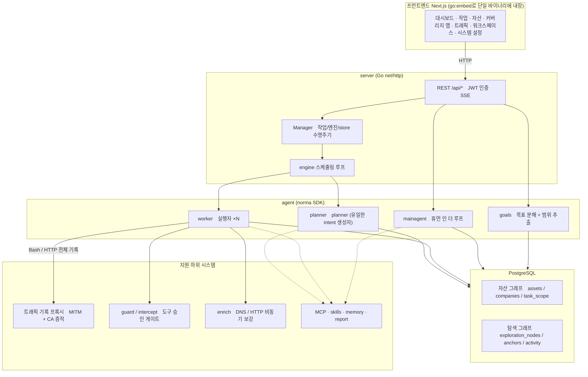
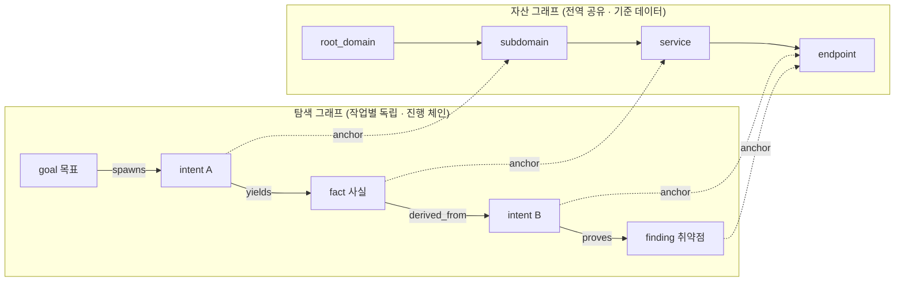
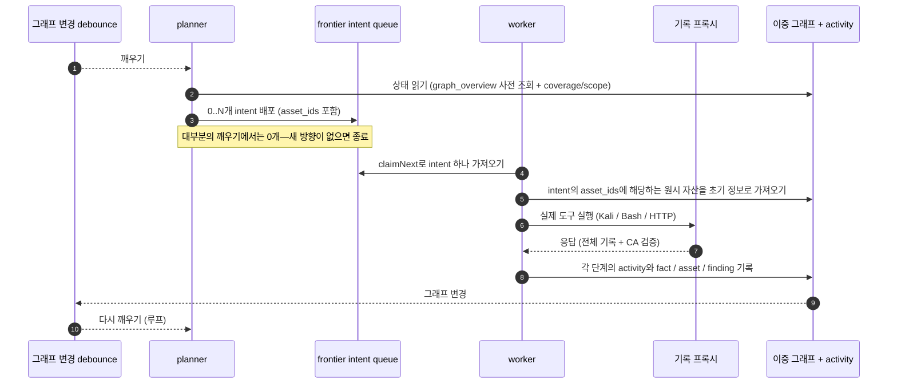
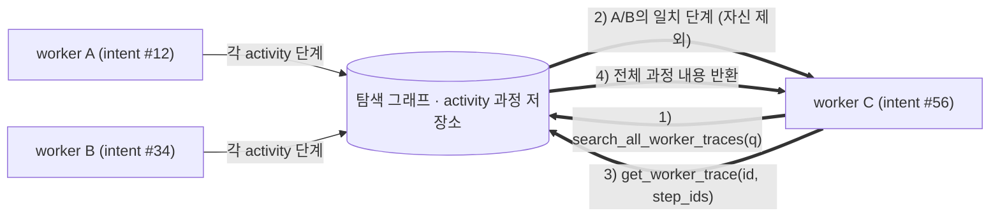
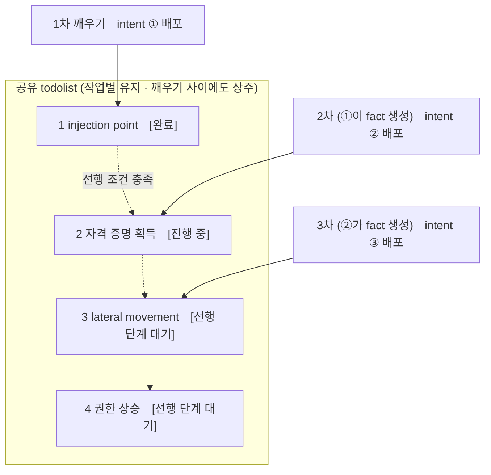

[중국어](README.md) | [English](README.en.md) | [한국어](README.ko.md)

<div align="center">

# ARTEX

AI 자율 침투 테스트 시스템 (Go 백엔드 + Next.js 프런트엔드)

🌐 **온라인 데모**: [https://artex-demo.vercel.app/](https://artex-demo.vercel.app/)

</div>

> 내부 배포 검토 자료: [문서 목록](docs/README.ko.md) · [아키텍처](docs/architecture.ko.md) · [보안 및 백도어 검토](docs/security-review.ko.md)

---

## 스크린샷

> 전체 상호작용은 [온라인 데모](https://artex-demo.vercel.app/)에서 확인할 수 있습니다.

| 대시보드 (개요 / Token 사용량 / 활동 스트림) | 작업 목록 |
| :---: | :---: |
|  |  |

| 작업 · 실행 과정 (세션 / 도구 호출) | 탐색 그래프 |
| :---: | :---: |
|  |  |

| 발견 항목 | 자산 |
| :---: | :---: |
|  |  |

| 자산 커버리지 맵 (힘 기반 레이아웃 · 테스트 완료 강조 · 노드 접기/펼치기) |
| :---: |
|  |

| 트래픽 기록 | 휴먼 인 더 루프 대화 |
| :---: | :---: |
|  |  |

| Agent 관리 | LLM 설정 |
| :---: | :---: |
|  |  |

| 인터셉트 승인 | 백엔드 로그 |
| :---: | :---: |
|  |  |

---

## 승인 기록 상세

전역 **승인 기록**, 작업 내 **인터셉트 승인**, 대화의 승인 카드는 모두 펼쳐 상세 내용을 볼 수 있습니다. 표시 구조는 [AegisHook의 승인 상세 컴포넌트](https://github.com/RuoJi6/AegisHook/blob/main/web/src/components/CallDetail.vue)를 참고하며 ARTEX의 컴포넌트와 테마를 사용합니다.

## 자산 동기화 (ScopeSentry)

[ScopeSentry](https://github.com/Autumn-27/ScopeSentry)에서 자산 데이터를 직접 동기화하여 중복 수집을 줄일 수 있습니다.

- **자산 동기화** 페이지에서 ScopeSentry 주소와 API Key를 입력해 데이터 소스를 연결합니다.
- **프로젝트** 또는 **작업** 단위로 동기화할 대상과 자산 유형(도메인 / 서브도메인 / IP / 포트 / 사이트 / 엔드포인트 등)을 선택합니다.
- 한 번의 클릭으로 가져온 뒤 회사 자산 범위에 따라 병합하면 ARTEX 자산 그래프로 전달되어 Agent가 탐색할 수 있습니다.

---

## 설치

> **PostgreSQL**이 필요합니다. 탐색에는 **LLM** 설정이 필요하며(`ANTHROPIC_API_KEY` 또는 `OPENAI_API_KEY`), UI에서도 설정할 수 있습니다.

### 방법 1: 원클릭 설치 스크립트 (권장)

```bash
git clone https://github.com/Autumn-27/ARTEX.git
cd ARTEX
./install.sh
```

스크립트가 Docker를 확인하고(없으면 공식 설치 안내를 제공하며 원격 설치 스크립트를 실행하지 않음), **① 전체 Docker** 또는 **② 로컬 컴파일 및 실행**을 선택하게 합니다.

- **① 전체 Docker**: Postgres 비밀번호 입력(Enter는 무작위 비밀번호) → `.env` 자동 작성 → `docker compose up -d`.
- **② 로컬 실행**: 데이터베이스 선택(기존 연결 / Docker로 실행) → `config.json` 생성 → 내장 단일 바이너리를 `go`로 컴파일 → 시작.

설치 후 **http://localhost:8787**을 엽니다. 첫 접속 시 `/setup`에서 관리자 비밀번호를 설정합니다.

### 방법 2: Docker Compose (수동)

```bash
git clone https://github.com/Autumn-27/ARTEX.git
cd ARTEX
cp .env.example .env          # POSTGRES_PASSWORD 입력, 선택적으로 ANTHROPIC_API_KEY 설정
docker compose up -d          # autumn27/artex 이미지 + postgres 가져오기
# → http://localhost:8787
```

이미지에는 일반 도구(ripgrep/curl/vim/npm/nmap 등)가 포함되며 `./skills`, `./data`, JWT key 디렉터리 `./state`는 바인드 마운트로 영속화됩니다.

원격 MCP는 시스템 설정에서 `http`(Streamable HTTP) 또는 `sse`(레거시 SSE)를 선택합니다. 레거시 SSE 서비스는 보통 `GET /sse`로 이벤트 스트림을 만들고 서비스가 반환한 `/message?sessionId=...`로 JSON-RPC 요청을 받습니다. 설정 시 URL은 `/sse`, 요청 헤더는 `Authorization=Bearer <token>`으로 입력합니다.

### 방법 3: 미리 빌드된 바이너리 다운로드 (Releases)

[Releases](https://github.com/Autumn-27/ARTEX/releases)에서 플랫폼용 zip을 다운로드해 압축을 풀면 `artex` + `start.sh`(Windows는 `start.bat`) + `skills/` + `config.example.json`을 얻습니다.

```bash
cp config.example.json config.json   # database 연결 정보 입력
./start.sh                           # → http://localhost:8787
```

> `./artex`를 직접 실행하지 말고 `start.sh` / `start.bat`로 시작하세요. 이 감시 스크립트는 프로그램 종료 후 종료 코드에 따라 재실행 여부를 결정하며 **[페이지 원클릭 업데이트](#방법-1-페이지-원클릭-업데이트-권장)는 이 스크립트로 교체를 완료합니다**. `./artex`를 직접 실행하면 업데이트 후 다시 시작되지 않습니다.
> 백그라운드 상주: `nohup ./start.sh >artex.log 2>&1 &`.

### 방법 4: 소스에서 단일 바이너리 빌드

```bash
# 1) 프런트엔드 정적 export
cd web && npm ci && npm run build:static && cd ..
# 2) 내장 디렉터리로 복사
cp -r web/out server/webui/dist
# 3) 빌드 (-tags embedui가 프런트엔드를 내장)
CGO_ENABLED=0 go build -tags embedui -o artex ./cmd/artex
./start.sh
```

### 방법 5: 크로스 플랫폼 Release 압축 패키지 빌드

`build.sh`는 프런트엔드를 빌드·내장하고 Go linker로 디버그 정보를 제거한 뒤 릴리스 파일을 zip으로 압축합니다. 기본적으로 Linux amd64/arm64, macOS amd64/arm64, Windows amd64용 zip을 생성합니다.

```bash
./build.sh --release
# 결과물: dist/artex-0.3.3-*.zip
```

UPX 자체 압축 해제 바이너리는 일부 Linux 커널, 가상화 환경 또는 보안 정책과 호환되지 않을 수 있어 기본적으로 사용하지 않습니다. `ARTEX_TARGETS`로 대상을 지정할 수 있으며, 호환성을 확인한 경우 `--upx`를 명시해 바이너리를 더 줄일 수 있습니다.

```bash
ARTEX_TARGETS=linux/amd64,windows/amd64 ./build.sh --release
./build.sh --target linux/amd64 --upx
```

---

## 업데이트 및 업그레이드

> 업그레이드는 프로그램만 교체하며 데이터를 변경하지 않습니다. Postgres 데이터 볼륨 `pgdata`, `./data`(workspace / SQLite 등), `./state`(JWT key), `./skills`는 유지됩니다. **데이터베이스 마이그레이션을 수동으로 실행할 필요가 없습니다**—`artex`는 시작할 때마다 `schema.sql`을 멱등적으로 다시 실행하므로(`ADD COLUMN` / `CREATE INDEX IF NOT EXISTS` 포함) 재시작이 곧 마이그레이션입니다. 업그레이드 전에는 `./data`, `./state`, 데이터베이스를 백업하는 것이 좋습니다.

<a id="방법-1-페이지-원클릭-업데이트-권장"></a>
### 방법 1: 페이지 원클릭 업데이트 (권장)

**시스템 설정** 페이지(사이드바 **시스템 설정** → `/system/settings`)의 **버전 및 업데이트** 카드에서 서버에 로그인하지 않고 새 버전을 확인·설치할 수 있습니다.

**업데이트**를 누르면 현재 플랫폼 Release 패키지 다운로드 → Release의 `SHA256SUMS`와 비교 → `-h`로 새 바이너리 스모크 테스트 → `artex.new`로 임시 저장 → 프로그램 종료 → `start.sh` / `start.bat`가 재실행되어 교체를 완료합니다. 새 버전이 올라오면 페이지가 자동 새로고침됩니다.

- **실패해도 망가진 프로그램이 남지 않습니다**: 검증 또는 스모크 테스트 실패 시 임시 파일을 삭제하고 현재 버전을 계속 실행합니다. 새 버전이 3회 연속 시작에 실패하면 `artex.old`로 자동 롤백하며 실패 버전은 `artex.failed`로 남깁니다.
- **언제든 롤백할 수 있습니다**: 이전 버전은 `artex.old`로 보관되고 카드에 **이전 버전으로 롤백** 버튼이 있습니다. 데이터베이스 구조는 롤백되지 않습니다.
- **업데이트는 실행 중인 작업을 중단합니다**—재시작되므로 유휴 상태에서 업데이트하세요.
- **개발 빌드는 업데이트하지 않습니다**: 버전이 `dev`이거나 `git describe`에 접미사가 있으면 업데이트가 비활성화됩니다.
- **Docker에서는 프로그램만 교체하고 이미지는 교체하지 않습니다**: 이미지의 Playwright / nmap 등은 업데이트되지 않으며 `docker compose up -d`로 컨테이너를 다시 만들면 이미지 버전으로 돌아갑니다. 이미지까지 업그레이드하려면 `docker compose pull artex && docker compose up -d artex`를 사용하세요.
- GitHub에 프록시가 필요하면 같은 페이지에서 **전역 프록시**를 설정하세요. 업데이트는 GitHub 도메인에서만 다운로드하며 HTTPS를 강제합니다.

### 방법 2: 원클릭 업데이트 스크립트

```bash
cd ARTEX
./update.sh
```

스크립트는 선택적으로 `git pull`로 최신 코드를 가져온 뒤 **① Docker 업데이트** 또는 **② 로컬 컴파일 업데이트**(`install.sh`와 동일한 방식)를 선택하게 합니다.

- **① Docker**: 이미지 tag 지정(Enter는 `.env`의 `ARTEX_TAG`, 현재 template 기본값 `v0.3.15`) → `docker compose pull` → `docker compose up -d`(새 이미지 재시작 및 schema 자동 마이그레이션).
- **② 로컬**: 프런트엔드 정적 결과물 재빌드 → `./artex` 재컴파일(재시작 후 적용).

### 방법 3: Docker Compose (수동)

```bash
cd ARTEX
git pull                       # compose / 스크립트 업데이트 (선택)
# 버전 지정: .env에 ARTEX_TAG=v0.3.15 설정, 지정하지 않으면 현재 Compose의 고정 버전 사용
docker compose pull artex
docker compose up -d artex     # 새 이미지로 교체 및 재시작 → schema 자동 마이그레이션
docker image prune -f          # 이전 이미지 정리 (선택)
```

### 방법 4: 미리 빌드된 바이너리 (Releases)

[Releases](https://github.com/Autumn-27/ARTEX/releases)에서 새 버전 zip을 다운로드하고 기존 프로세스를 중지한 뒤 `artex`와 `skills/`를 덮어씁니다(`config.json`과 `data/`는 유지). 그 후 재시작합니다.

```bash
cp -r <압축-해제-디렉터리>/skills ./ && cp <압축-해제-디렉터리>/artex ./
./start.sh
```

### 방법 5: 소스에서 빌드

```bash
git pull
cd web && npm ci && npm run build:static && cd ..
cp -r web/out server/webui/dist
CGO_ENABLED=0 go build -tags embedui -o artex ./cmd/artex
# ./start.sh 재시작
```

---

## 설정

**데이터베이스** (`config.json`, 또는 `ARTEX_PG_DSN` 환경 변수로 덮어쓰기):

```json
{
  "database": {
    "host": "127.0.0.1", "port": 5432,
    "user": "artex", "password": "yourpass",
    "dbname": "artex", "sslmode": "disable"
  }
}
```

**LLM**: `export ANTHROPIC_API_KEY=sk-...`(또는 `OPENAI_API_KEY`)를 사용하거나 UI의 **LLM 설정** 페이지에 입력합니다. 선택 사항: `ARTEX_LLM_PROVIDER` / `ARTEX_LLM_MODEL` / `ARTEX_LLM_BASE_URL` / `ARTEX_LLM_PROXY`.

**동시성**: **시스템 설정**에서 작업당 work agent 수를 설정합니다(기본값 3).

**주요 매개변수**: `./start.sh -addr :8787 -proxy :8788` (`-addr`는 프런트엔드 + API, `-proxy`는 트래픽 기록 프록시). 시작 스크립트는 인자를 `artex`에 그대로 전달합니다.

### 리버스 프록시 배포 (HTTPS / 443만 공개)

프런트엔드와 API/SSE는 같은 백엔드 포트(기본 `:8787`)에서 제공됩니다. 실시간 활동 스트림은 기본적으로 **동일 출처**를 사용하므로 **`NEXT_PUBLIC_SSE_BASE`를 설정할 필요가 없습니다**. 외부에는 443만 공개하고 8787은 내부 네트워크에 두면 됩니다.

SSE는 장시간 연결과 지속적인 push를 사용하므로 리버스 프록시는 **반드시 버퍼링을 꺼야 합니다**. 그렇지 않으면 브라우저가 연결되어도 이벤트를 받지 못해 활동 스트림이 계속 로딩됩니다. Nginx 예시:

```nginx
server {
    listen 443 ssl;
    server_name your.domain.com;
    # ssl_certificate / ssl_certificate_key ...

    location / {
        proxy_pass http://127.0.0.1:8787;
        proxy_set_header Host $host;
        proxy_set_header X-Forwarded-Proto $scheme;

        # SSE 핵심 설정: 버퍼링 해제, 긴 타임아웃, HTTP/1.1
        proxy_buffering off;
        proxy_cache off;
        proxy_read_timeout 3600s;
        proxy_http_version 1.1;
        proxy_set_header Connection "";
    }
}
```

> SSE가 페이지와 다른 출처(예: 별도 서브도메인)를 사용해야 할 때만 **빌드 시점**에 `NEXT_PUBLIC_SSE_BASE`를 설정하세요. 이 변수는 `next build` 시 정적 패키지에 고정되므로 컨테이너 실행 시 설정해도 적용되지 않습니다.

---

## 개발

### 수동 취약점 재테스트

작업 상세의 **재테스트** 탭에서 이 작업의 취약점을 페이지 단위로 선택하고 이전 결론과 증거를 확인하며 재테스트를 수동 시작할 수 있습니다. 시작하면 현재 탭을 유지한 채 스피너와 **재테스트 중**이 표시되고, 수정이 확인되면 취약점 상태가 동기화됩니다.

취약점 목록 각 행의 작업 영역에서 **재테스트**를 클릭하거나 취약점 상세의 **취약점 재테스트** 영역에서 **재테스트 시작**을 클릭하세요. 선택적으로 수정 버전, 테스트 조건 또는 제한 사항을 입력할 수 있습니다. 시스템은 독립적인 재테스트 Agent 세션을 만들고 시작 후에도 현재 페이지를 유지합니다. 목록 평면 보기, 작업별 그룹 보기, 자산 보기 모두 지원합니다. 실행 중에는 스피너와 **재테스트 중**이 표시되고, 해당 세션에서 내용을 확인할 수 있습니다. 종료되면 다시 **재테스트**로 표시됩니다. 원래 스캔 작업을 재시작할 필요가 없으며 결론은 **여전히 재현됨**, **수정됨**, **확인할 수 없음**으로 나뉩니다. 결론·증거·세션 링크는 취약점 상세에 저장됩니다.

새 백엔드 버전은 최초 시작 시 편집 가능한 **취약점 재테스트**(`retester`) Agent를 생성합니다. Agent 관리에서 프롬프트, LLM, 실행 예산 및 도구를 설정할 수 있습니다. 연결된 LLM을 우선 사용하고 없으면 전역 활성 설정을 사용합니다. 재테스트가 성공적으로 완료되고 결론이 **수정됨**이면 처리 상태도 자동으로 **수정됨**이 됩니다. 실행 중, 실패, 중지 또는 다른 결론에서는 원래 상태를 유지합니다. 원본 증거와 보고서는 항상 보존되며, 상태 드롭다운에서 **수정됨**을 직접 선택할 수도 있습니다. 같은 취약점이 재테스트 중이면 기존 세션을 재사용하고, 중지·실패·서비스 재시작 후 다시 시작할 수 있습니다.

이 버전의 이력은 취약점 상세와 세션에서 확인할 수 있습니다. 아직 취약점 보고서 export나 작업 아카이브 패키지에는 포함되지 않고 트래픽 패키지와 자동 연결되지도 않습니다. 데모 모드는 명확히 표시된 시뮬레이션 기록만 생성하며 실제 대상에는 요청하지 않습니다.

### 로컬 실행 및 테스트

```bash
./dev.sh    # 백엔드(:8787) + 트래픽 프록시(:8788) + 프런트엔드 next dev(:5173) → http://localhost:5173
```

- 백엔드: `go run ./cmd/artex` (`-tags embedui`가 없으면 프런트엔드를 내장하지 않음)
- 프런트엔드: `cd web && npm run dev` (`/api`를 백엔드로 프록시하며 hot reload 지원)
- 테스트: `go test ./...`
- Mock 미리보기(백엔드 없음): `cd web && NEXT_PUBLIC_MOCK=1 npm run dev`

---

## 시스템 기술 아키텍처

ARTEX는 **LLM 멀티 Agent 기반 자율 침투 테스트 시스템**입니다. Go 모놀리식 백엔드(Next.js 프런트엔드 내장) + PostgreSQL로 구성되며 Agent 기능은 [`norma`](https://github.com/Autumn-27/norma) SDK(`agentcore` / `tool` / `permission` / `harness` / `memory` / `transcript`)가 제공합니다. 핵심은 **이중 그래프 아키텍처**와 **worker 간 프로세스 수준 정보 교환**, **공유 다중 라운드 todolist를 사용하는 planner의 안정적인 공격 체인**입니다.

### 전체 계층



| 계층 | 역할 |
| --- | --- |
| **프런트엔드** | Next.js 정적 export를 `go:embed`로 단일 바이너리에 내장; 작업 / 자산 / 탐색 그래프 / 커버리지 맵 시각화 및 휴먼 인 더 루프 대화 |
| **server** | `net/http` 라우팅 + JWT 인증 + SSE; `Manager`가 작업·엔진·DB store 수명주기를 관리 |
| **engine** | 작업마다 `plannerLoop` 하나와 N개의 worker goroutine; intent 가져오기, 타임아웃 / 일시정지 / drain |
| **agent** | goals / planner / worker / mainagent, `ToolSet`으로 이중 그래프를 LLM 도구로 노출 |
| **db** | 이중 그래프의 PostgreSQL 저장소 (pgx); `go:embed`로 시작할 때마다 schema 테이블을 멱등 생성 |
| **지원 시스템** | 기록형 MITM 프록시, 승인 게이트, 비동기 보강, MCP / skills / memory / report |

### 이중 그래프 아키텍처: 탐색 그래프 + 자산 그래프

시스템은 **목표가 무엇인지**와 **얼마나 테스트했는지**를 anchor로 연결된 두 개의 독립 그래프로 분리합니다.

- **자산 그래프(전역 공유)**: 작업 간 공유되는 자산의 기준 데이터입니다. 노드는 `root_domain / subdomain / ip / service / app / endpoint`이며 회사에 속합니다. 도메인 → 서브도메인 → 서비스 → 엔드포인트의 부모-자식 관계와 중복 제거 key는 프로그램이 계산하고 Agent는 원시 정보만 제출합니다.
- **탐색 그래프(작업별 독립)**: 한 작업의 “사고와 진행” 과정입니다. `goal` / `intent` / `fact` / `finding` / `hint` 노드가 `spawns / derived_from / yields / proves` 등의 edge로 이어져 **계보 체인**을 만들고 어느 사실에서 어떤 방향과 결과가 나왔는지 보여줍니다.
- **두 그래프는 anchor로 연결됩니다**: `exploration_anchors(node_id, asset_id)`가 intent / fact / finding을 특정 자산에 연결합니다. 따라서 탐색 방향에서 검사한 자산을 보거나, 특정 자산에서 어떤 intent가 검사했고 어떤 fact를 얻었는지 역추적할 수 있습니다. 이는 **자산 테스트 커버리지**와 **자산 커버리지 맵**(범위 내 자산 + 테스트 완료 강조)을 지원합니다.



> 역할 분담: **planner**는 탐색 그래프 상태를 읽고 목표를 판단하며, 새로 커버되지 않은 방향이 있을 때만 **intent**를 frontier에 추가합니다. **worker**는 **하나의 intent**를 받아 실제 도구로 실행하고 새 자산 / fact / finding을 두 그래프에 기록한 뒤 멈춥니다. 자산 그래프는 공유 사실이고 탐색 그래프는 작업별 진행 체인입니다.

### 엔진과 intent 수명주기 (한 번의 탐색 루프)

엔진은 **이벤트 기반** 루프입니다. 그래프가 바뀌면 planner가 깨어나고 intent를 배포합니다. worker가 intent를 받아 실행하고 결과를 기록하면 다음 라운드가 시작되며 목표가 증명될 때까지(`prove_goal`) 반복됩니다.



### worker 간 프로세스 수준 정보 교환

깊은 탐색 중에는 유용한 관찰(오류, 응답 일부, 숨은 파라미터)이 worker의 **실행 과정**에는 나타나지만 정식 fact가 되지 않을 수 있습니다. 중복 작업을 막고 worker가 서로의 결과를 활용하도록 **작업 간 실행 과정 검색**을 제공합니다.

- `search_all_worker_traces(q)`: **현재 작업에서 다른 work의 실행 과정**을 키워드로 검색합니다(현재 intent의 단계는 자동 제외). 결과에는 `intent_id`가 포함됩니다.
- `list_worker_traces` / `get_worker_trace(intent_id, step_ids=[…])`: 실행된 work를 확인한 뒤 특정 work의 구체적인 단계 전체를 가져옵니다.

탐색 그래프에 fact가 아직 없어도 이후 worker는 다른 worker 과정의 관찰을 재사용할 수 있습니다. **정보는 실행 과정 단위로 worker 사이를 흐르지만**, 각 worker는 자신이 받은 intent만 수행합니다.



### planner의 다중 라운드 공유 todolist → 안정적인 공격 체인

실제 공격 체인은 **선후 의존성이 있는 여러 단계**(예: injection point 발견 → 자격 증명 획득 → lateral movement → 권한 상승)인 경우가 많습니다. 이를 한 번에 병렬 배포하면 순서가 꼬입니다. planner는 **작업별로 유지되고 깨우기 사이에 공유되는 계획 todolist**를 보유합니다.

- planner는 이벤트 기반이지만 **매번 새로운 세션**입니다. 공유 todolist는 직렬 exploit 체인을 **한 번 기록**하고 이후 라운드에서 의존성에 따라 intent를 단계적으로 배포하게 합니다.
- 각 라운드에서 선행 단계가 완료되고 필요한 fact가 있는 다음 단계만 배포하고, fact가 충족한 단계는 완료로 표시합니다.



이렇게 **이벤트 기반 + 무상태 세션** 환경에서도 공격 체인이 중복이나 순서 오류 없이 안정적으로 진행됩니다. 이것이 ARTEX가 여러 단계의 exploit 체인을 자율적으로 완료하는 핵심입니다.

---

## 커뮤니티

QR 코드를 스캔해 **SecSentry** WeChat 공식 계정을 팔로우하세요. 계정에서 다이렉트 메시지를 보내 커뮤니티에 참여할 수 있습니다.

<div align="center">


</div>

---
## 참고

https://github.com/oritera/Cairn

## 라이선스 및 면책

### 오픈소스 라이선스

이 프로젝트는 **GNU Affero General Public License v3.0 (AGPL-3.0)**으로 배포됩니다. 전체 조항은 저장소 루트의 [LICENSE](LICENSE) 파일을 확인하세요.

누구나 이 프로젝트를 자유롭게 사용·수정·배포할 수 있지만 **파생 저작물도 AGPL-3.0으로 공개해야 합니다**. 특히 **이 프로젝트를 수정해 네트워크를 통해(예: 온라인 서비스로 배포해) 사용자에게 제공하는 경우 대응하는 전체 소스 코드도 해당 사용자에게 공개해야 합니다**.

> ⚠️ **중요**: 오픈소스 라이선스 자체는 소프트웨어 사용 목적을 제한하지 않습니다. 아래 **사용 제한**과 **면책 조항**은 저자가 정한 추가 조건이자 엄중한 고지이므로 반드시 준수하세요.

**ARTEX는 개인 학습, 코드 연구 및 로컬 기술 검증만을 위한 도구이며, 온라인 시스템이나 웹사이트를 대상으로 실제 테스트를 수행하는 데 사용할 수 없습니다.**

### 허용되는 사용 범위

- **이 프로젝트의 소스 코드를 읽고 학습·연구**하거나 **로컬 격리 환경**에서 기술 원리를 검증하는 용도로만 사용합니다.
- 개인 학습, 학술 연구, 코드 검토 등 공격 목적이 아닌 용도에 적합합니다.

### 금지 사항

- **어떠한 웹사이트, 온라인 서비스 또는 네트워크 시스템에도 이 도구로 스캔·탐색·exploit·공격을 수행하는 것을 엄격히 금지합니다**(승인을 받았는지 또는 자신의 자산인지와 무관).
- 실제 침투 테스트, 레드팀/블루팀 대항 또는 운영 환경에 사용하지 마세요.
- 불법 침입, 데이터 탈취, 협박, 서비스 거부 또는 파괴적·범죄적 활동에 사용하지 마세요.
- 거주 국가/지역의 법률과 규정을 위반하는 행위에 사용하지 마세요.

### 준법 책임

사용자는 거주 국가/지역의 사이버 보안, 데이터 보호 및 컴퓨터 범죄 관련 모든 법률과 규정을 준수해야 합니다. **이 도구의 사용으로 발생하는 모든 법적 책임과 결과는 사용자 본인이 부담합니다.**

### 면책 조항

이 프로젝트는 명시적 또는 묵시적 보증 없이 **있는 그대로(AS IS)** 제공됩니다. 저자와 기여자는 이 도구의 사용으로 발생하는 직접·간접 손실, 데이터 손실, 시스템 손상 또는 법적 분쟁에 대해 책임을 지지 않습니다. **이 프로젝트를 다운로드·설치·사용하면 위의 모든 조항을 읽고 이해했으며 동의한 것으로 간주합니다.**
