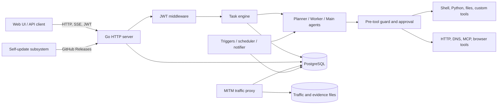

# ARTEX Architecture

[Chinese](../README.md) | [English](architecture.en.md) | [Korean](architecture.ko.md)

This document describes the architecture observed in ARTEX `v0.3.15` (`e6ec569`). It is a code-level snapshot, not a promise that later upstream releases have the same design.

## System purpose

ARTEX is an autonomous penetration-testing platform. A Go service coordinates LLM-backed planner, worker, and conversational agents; exposes an authenticated JSON/SSE API; stores operational state in PostgreSQL; records HTTP traffic through an optional MITM proxy; and serves a statically exported Next.js interface.

## Runtime topology

## Startup and shutdown

1. [`start.sh`](../start.sh) supervises the binary and restarts it after the reserved update exit code.
2. [`cmd/artex/main.go`](../cmd/artex/main.go) parses the HTTP, data-directory, JWT-key-directory, and proxy flags.
3. The self-update bootstrap installs or rolls back a staged binary before network listeners and stores are opened.
4. [`server.NewManager`](../server/manager.go) opens PostgreSQL, initializes the traffic store and optional MITM proxy, and loads persistent settings.
5. [`server.New`](../server/server.go) loads the JWT key, wires agents and tools, restores task runtimes, and starts background schedulers, notifications, MCP discovery, evidence garbage collection, and archive processing.
6. The HTTP server listens until a signal or update request triggers graceful shutdown.

## Major components

| Component | Responsibility | Main paths |
| --- | --- | --- |
| Process entrypoint | Flags, lifecycle, update bootstrap, HTTP listener | `cmd/artex`, `start.sh`, `selfupdate` |
| API and orchestration | Routes, authentication, task admission, agent lifecycle, settings | `server` |
| Agent runtime | Planner/worker/main-agent prompts, tool catalog, goals, context compaction | `agent` |
| Safety boundary | Tool-call audit, intercept rules, model or human approval | `guard`, `intercept` |
| Persistence | Schema migration, tasks, assets, findings, traffic metadata, settings | `db/schema.sql`, `db` |
| Traffic and evidence | MITM capture, archive, evidence retention | `traffic`, `evidence` |
| Integrations | MCP clients, ScopeSentry, notifications, search and enrichment | `mcphttp`, `notify`, `enrich`, `server/sync_scopesentry.go` |
| Frontend | Static Next.js user interface | `web` |
| Security skills | Agent playbooks and helper scripts | `skills` |

## Primary control flows

### Authenticated request

`/api/*` request → CORS wrapper → JWT middleware → route handler → `Manager`, `Engine`, or PostgreSQL → JSON/SSE response.

The authentication bootstrap and health endpoints are intentionally exempt. SSE currently supports a query-string token, which is a deployment risk described in the security review.

### Autonomous task

Task admission → planner creates or selects intents → worker executes bounded work → each tool call passes through the guard hook → results and findings are stored → planner continues, stops, or schedules follow-up work.

The guard does not contain an immutable destructive-action policy. Its main enforcement comes from database-configured intercept rules and optional model/human review. Administrators can disable or delete seeded rules, so deployment policy is part of the trusted computing base.

### Tool execution

Agents receive built-in Norma tools plus ARTEX tools. Depending on configuration, the tool surface includes shell commands, file reads/writes, temporary Python scripts, custom command tools, remote or stdio MCP servers, HTTP/DNS probes, browser automation, and database-backed finding/asset operations.

### Data persistence

- PostgreSQL is authoritative for tasks, agents, prompts, settings, findings, assets, approvals, notifications, and usage records.
- The filesystem holds the JWT signing key outside the browsable workspace, plus task workspaces, traffic/evidence artifacts, generated custom-tool scripts, and self-update staging files.
- The traffic proxy can observe sensitive target traffic. Its CA material and captured bodies must be treated as secrets.

## Trust boundaries

1. **Browser/API boundary:** a valid administrator token grants extensive configuration and execution authority.
2. **LLM boundary:** model output is untrusted and can attempt prompt injection, destructive commands, or exfiltration.
3. **Host-execution boundary:** shell, Python, custom tools, and stdio MCP can access the service account's host permissions and environment.
4. **Target-network boundary:** enrichment, browser, MCP, notification, and scanning traffic create outbound connections.
5. **Persistence boundary:** PostgreSQL and filesystem contents influence prompts, tools, policies, and future executions.
6. **Supply-chain boundary:** containers, npm/Go modules, GitHub Actions, releases, and the self-update channel can change executable code.

## Deployment model for internal security use

Run ARTEX as a high-privilege security appliance, not as a normal multi-tenant web application:

- isolate it in a dedicated VM or restricted container host;
- expose the UI only through an authenticated management network;
- use a low-privilege service account and an egress allowlist;
- inject short-lived credentials only into the specific tool that needs them;
- keep approval rules immutable to ordinary operators;
- separate scanning networks from production control planes;
- back up PostgreSQL and the evidence directory, and encrypt both at rest;
- disable self-update in controlled environments and promote reviewed builds through an internal registry.

See [Security Review](security-review.en.md) for the current findings and acceptance gates.
