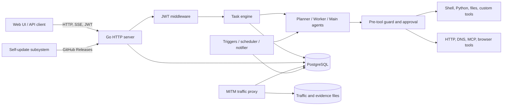

# ARTEX 아키텍처

[중국어](../README.md) | [English](architecture.en.md) | [한국어](architecture.ko.md)

이 문서는 ARTEX `v0.3.15` (`e6ec569`) 소스에서 확인한 구조를 설명합니다. 이후 업스트림 릴리스가 동일한 구조를 유지한다는 보장은 아닙니다.

## 시스템 목적

ARTEX는 자율 침투 테스트 플랫폼입니다. Go 서비스가 LLM 기반 planner, worker, 대화형 agent를 조정하고, 인증된 JSON/SSE API를 제공하며, PostgreSQL에 운영 상태를 저장합니다. 선택적 MITM 프록시로 HTTP 트래픽을 기록하고 정적으로 내보낸 Next.js UI를 제공합니다.

## 런타임 토폴로지

## 시작 및 종료 흐름

1. [`start.sh`](../start.sh)가 바이너리를 감독하고 예약된 업데이트 종료 코드가 발생하면 재시작합니다.
2. [`cmd/artex/main.go`](../cmd/artex/main.go)가 HTTP 주소, 데이터 디렉터리, JWT 키 디렉터리, 프록시 플래그를 해석합니다.
3. 네트워크 리스너와 저장소를 열기 전에 self-update bootstrap이 준비된 바이너리를 설치하거나 롤백합니다.
4. [`server.NewManager`](../server/manager.go)가 PostgreSQL을 열고, 트래픽 저장소와 선택적 MITM 프록시를 초기화하고, 영구 설정을 불러옵니다.
5. [`server.New`](../server/server.go)가 JWT 키를 불러오고 agent와 도구를 연결하며, task runtime을 복구하고 scheduler, 알림, MCP 탐색, evidence GC, archive 처리를 시작합니다.
6. 신호 또는 업데이트 요청이 graceful shutdown을 시작할 때까지 HTTP 서버가 동작합니다.

## 주요 구성 요소

| 구성 요소 | 책임 | 주요 경로 |
| --- | --- | --- |
| 프로세스 진입점 | 플래그, 생명주기, 업데이트 bootstrap, HTTP listener | `cmd/artex`, `start.sh`, `selfupdate` |
| API 및 오케스트레이션 | route, 인증, task admission, agent 생명주기, 설정 | `server` |
| Agent runtime | planner/worker/main-agent prompt, tool catalog, goal, context compaction | `agent` |
| 안전 경계 | tool-call audit, intercept rule, 모델 또는 사람 승인 | `guard`, `intercept` |
| 영속성 | schema migration, task, asset, finding, traffic metadata, 설정 | `db/schema.sql`, `db` |
| 트래픽 및 증거 | MITM capture, archive, evidence 보존 | `traffic`, `evidence` |
| 연동 | MCP client, ScopeSentry, 알림, 검색과 enrichment | `mcphttp`, `notify`, `enrich`, `server/sync_scopesentry.go` |
| 프런트엔드 | 정적 Next.js UI | `web` |
| 보안 skill | agent playbook과 helper script | `skills` |

## 주요 제어 흐름

### 인증된 요청

`/api/*` 요청 → CORS wrapper → JWT middleware → route handler → `Manager`, `Engine` 또는 PostgreSQL → JSON/SSE 응답.

인증 bootstrap과 health endpoint는 의도적으로 인증에서 제외됩니다. SSE는 현재 query string token을 지원하며, 관련 배포 위험은 보안 검토 문서에 설명합니다.

### 자율 task

Task admission → planner가 intent 생성 또는 선택 → worker가 범위가 정해진 작업 수행 → 모든 tool call이 guard hook 통과 → 결과와 finding 저장 → planner가 계속, 종료 또는 후속 작업 예약.

Guard에는 변경 불가능한 파괴 행위 금지 정책이 없습니다. 핵심 통제는 DB에 설정된 intercept rule과 선택적 모델/사람 검토에 의존합니다. 관리자가 seeded rule을 비활성화하거나 삭제할 수 있으므로 배포 정책 자체가 신뢰 기반의 일부입니다.

### 도구 실행

Agent는 Norma 기본 도구와 ARTEX 도구를 받습니다. 설정에 따라 shell command, 파일 읽기/쓰기, 임시 Python script, custom command tool, remote 또는 stdio MCP server, HTTP/DNS probe, browser automation, DB 기반 finding/asset 연산을 사용할 수 있습니다.

### 데이터 영속성

- PostgreSQL은 task, agent, prompt, 설정, finding, asset, 승인, 알림, 사용량 기록의 authoritative store입니다.
- 파일시스템에는 탐색 가능한 workspace 밖의 JWT signing key와 task workspace, traffic/evidence artifact, 생성된 custom-tool script, self-update staging file이 저장됩니다.
- 트래픽 프록시는 민감한 대상 트래픽을 관찰할 수 있습니다. CA 자료와 캡처된 본문은 비밀정보로 취급해야 합니다.

## 신뢰 경계

1. **브라우저/API 경계:** 유효한 관리자 token은 광범위한 설정 및 실행 권한을 부여합니다.
2. **LLM 경계:** 모델 출력은 신뢰할 수 없으며 prompt injection, 파괴 명령, 정보 유출을 시도할 수 있습니다.
3. **호스트 실행 경계:** shell, Python, custom tool, stdio MCP는 서비스 계정의 호스트 권한과 환경에 접근할 수 있습니다.
4. **대상 네트워크 경계:** enrichment, browser, MCP, 알림, scan traffic이 외부 연결을 만듭니다.
5. **영속성 경계:** PostgreSQL과 파일시스템 내용이 향후 prompt, tool, policy, 실행에 영향을 줍니다.
6. **공급망 경계:** container, npm/Go module, GitHub Actions, release, self-update channel이 실행 코드를 바꿀 수 있습니다.

## 내부 보안 점검용 배포 모델

ARTEX를 일반 다중 사용자 웹 애플리케이션이 아니라 높은 권한을 가진 보안 appliance로 운영하십시오.

- 전용 VM 또는 제한된 container host에 격리합니다.
- 인증된 관리 네트워크를 통해서만 UI를 노출합니다.
- 저권한 service account와 egress allowlist를 사용합니다.
- 짧은 수명의 credential을 필요한 도구에만 주입합니다.
- 일반 운영자가 승인 rule을 변경하지 못하게 합니다.
- scan network를 production control plane과 분리합니다.
- PostgreSQL과 evidence directory를 백업하고 저장 시 암호화합니다.
- 통제 환경에서는 self-update를 비활성화하고 검토한 build만 내부 registry로 승격합니다.

현재 finding과 도입 승인 gate는 [보안 검토](security-review.ko.md)를 참고하십시오.
