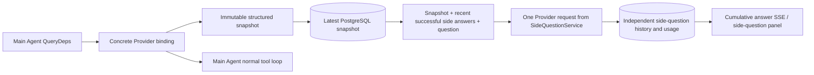

> Languages: [Chinese](README.md) | English | [Korean](README.ko.md)

# ARTEX `/btw`

Ordinary chat, a task MainAgent, and the current task’s own Worker can submit independent side questions. Enter `/btw question` in the main input to submit one; an empty `/btw` or the “side question” button opens history. Desktop uses a resizable sidebar; mobile uses a Drawer.

Side answers are generated from the Agent context snapshot captured at submission time. They support streaming display, follow-up questions, stopping, and clearing. Closing the panel, refreshing the page, or disconnecting SSE does not cancel the model request. Stop affects only the current side question; clear cancels side questions and deletes side-question history while retaining the main-context snapshot.

## Implementation boundaries

The implementation reuses Go, norma v0.3.7, Next.js, and the existing Markdown / ResizablePanel / Drawer / AlertDialog components. It does not modify norma source or add dependencies for side questions. Planner, Workers inherited from other tasks, and tool-type subtask upgrades are out of scope.

- `capture.go` marks only `Options.Deps.CallModel / CallModelSync` as main-loop requests. The Provider decorator is inside the concrete model, after outer routing-pool selection, so it records the actually selected model; compaction and summary requests do not overwrite the snapshot.
- A snapshot is published at request start, after the complete model reply, and at run termination. A partially generated reply is not published; norma’s `MessagesForAPI` keeps tool calls paired, and tool results enter the snapshot on the next main-model request or at run termination. Streaming abort retains the previous valid boundary.
- JSON deep-copying preserves structured messages, system prompts, tool definitions, and generation parameters. Model inference does not hold the snapshot lock or a database transaction.
- `SideQuestionService` calls the concrete Provider. When necessary, it first generates a side-question summary; only when the initial context exceeds the limit and no text/tool call has been output may the final answer be reduced and retried once. It does not create an agent session, connect to the tool executor, main transcript, active stream, or task graph, and it does not pass through the task model-switching chain. Tool definitions remain in the answer for compatibility with existing structured tool contexts; the new tool calls have no execution path.
- Each parent session has one running request, with at most four per service process and a 120-second timeout per request. Side questions use an independent cancellation context for the service lifetime.
- Side-question requests retain a model-configuration reference and a non-sensitive identity summary; credentials are read from existing configuration at request time. If the configuration is deleted or model, protocol, address, or other identity fields change, run the main Agent first to update the snapshot. Tests do not change the product’s default model.

## Persistence and recovery

`db/schema.sql` automatically creates `side_question_sessions` and `side_question_requests`. The former stores the parent resource, latest snapshot, run number, version, and cleanup version; the latter stores the question, cumulative answer, status, model, snapshot time, usage, event sequence, and page sequence.

The parent-session key is the conversation ID, or task ID + exploration ID + intent ID. Workers do not use reusable execution-slot names.

Snapshots are merged per parent session and refreshed every 250 ms. Database comparison of `(run_id, version)` prevents an old version from overwriting a new one. The selected snapshot is saved again before side-question submission. After a successful save, large in-memory snapshots are released; on failure, the pending-to-write version is retained. Cumulative answer content is written at most every 250 ms as streaming events arrive, and the terminal state is saved immediately with limited retry on database errors.

At service startup, leftover `running` requests are marked `interrupted`; persisted partial answers and usage are retained, and requests are not replayed automatically. The most recently saved context can be used directly for the next question. An old session without a snapshot must run the main Agent first; UI activity records are not used to reconstruct context.

Clear increments the cleanup version and deletes requests; conditional updates prevent late callbacks from writing back. Physical deletion of a parent resource relies on foreign-key cascading. Worker logical deletion removes side-question data in the same transaction and rejects later snapshots. Task archiving first blocks new requests, waits for the main flow to stop, then cancels side questions and waits for them to be persisted; archive format v3 remains compatible with v1/v2 that lack side-question tables.

History is stored in full, with at most 20 entries per ordinal-cursor page. A model request replays at most the 20 most recent successful question/answer originals, additionally limited by the token budget; older answers maintain an independent rolling summary. When the main context exceeds its budget, only the old part of the side-question copy is summarized, retaining recent structured tool calls and results. Summary, preparation progress, and usage share the side-question concurrency, cancellation, and 120-second timeout limits. See [Context budget and open-source references](CONTEXT_BUDGET.md).

## HTTP contract

The following paths are `{parent}` and use existing authentication and resource validation:

- `/api/conversations/{id}`
- `/api/tasks/{id}/chat`
- `/api/tasks/{id}/intents/{iid}`

| Request | Return and behavior |
| --- | --- |
| `GET {parent}/side-questions?before={ordinal}` | `items` newest first, independent `current` running status, `snapshot` metadata, `next_cursor`; cursor 0 means the latest page / no next page |
| `POST {parent}/side-questions` | JSON `{ "question": "…", "client_request_id": "UUID" }`; a new request returns 202 and the request object; the same ID and question return the existing object with 200 |
| `DELETE {parent}/side-questions` | Cancel and clear side questions for the current parent session |
| `GET /api/side-questions/{requestID}/events` | `snapshot` SSE events, `id` as an increasing sequence, `data` as the complete cumulative request object; clearing sends `cleared` |
| `POST /api/side-questions/{requestID}/cancel` | Explicit cancellation; read the terminal state from history or SSE |

The question limit is 4000 characters. No snapshot, changed model configuration, a busy parent session, or an idempotency-ID conflict returns 409; the global concurrency limit returns 429. Every SSE connection first sends cumulative state and does not depend on text fragments previously received by the client. The frontend merges by request ID + sequence and discards old callbacks when switching parent sessions or clearing.

## Verification and references

See [VALIDATION.md](VALIDATION.md) for automated checks, actual model use, and known limitations.

For an independent-request reference, see [Grok CLI side-question.ts (fixed revision)](https://github.com/superagent-ai/grok-cli/blob/fb97af83f06dca873281d60168430f06c8de6324/src/utils/side-question.ts); for isolated execution, see [OpenCode (fixed revision)](https://github.com/anomalyco/opencode/tree/b3f1a96c6dd7adeb28b36dd11add1998fc84d67b). ARTEX context uses norma structured messages rather than assembling text from frontend logs.
