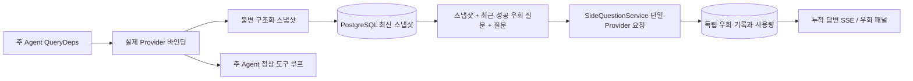

> 언어: [중국어](README.md) | [English](README.en.md) | 한국어

# ARTEX `/btw`

일반 채팅, 작업 MainAgent, 현재 작업의 Worker는 독립적인 우회 질문을 제출할 수 있습니다. 주 입력창에 `/btw 질문`을 입력해 제출하고, 빈 `/btw` 또는 “우회 질문” 버튼으로 기록을 엽니다. 데스크톱에서는 너비를 조절할 수 있는 사이드바를 사용하고 모바일에서는 Drawer를 사용합니다.

우회 답변은 제출 시점에 캡처한 Agent 컨텍스트 스냅샷으로 생성되며, 스트리밍 표시, 추가 질문, 중지와 비우기를 지원합니다. 패널을 닫거나 페이지를 새로 고치거나 SSE 연결이 끊겨도 모델 요청은 취소되지 않습니다. 중지는 현재 우회 질문에만 영향을 주고, 비우기는 우회 질문을 취소하고 우회 기록을 삭제하지만 주 컨텍스트 스냅샷은 보존합니다.

## 구현 범위

Go, norma v0.3.7, Next.js 및 기존 Markdown / ResizablePanel / Drawer / AlertDialog 컴포넌트를 재사용합니다. norma 소스는 수정하지 않으며 우회 질문용 의존성도 추가하지 않습니다. Planner, 다른 작업에서 상속된 Worker, 도구형 하위 작업 업그레이드는 이번 범위에 포함되지 않습니다.

- `capture.go`는 `Options.Deps.CallModel / CallModelSync`만 주 루프 요청으로 표시합니다. Provider 데코레이터는 구체적인 모델 내부, 라우팅 풀의 외부 선택 이후에 있으므로 실제 선택된 모델을 기록합니다. 압축 및 요약 요청은 스냅샷을 덮어쓰지 않습니다.
- 요청 시작, 완전한 모델 응답, 실행 종단 상태에서 스냅샷을 게시합니다. 생성 중인 일부 응답은 게시하지 않습니다. norma의 `MessagesForAPI`가 도구 호출의 짝을 유지하며, 도구 결과는 다음 주 모델 요청 또는 실행 종단 상태에서 스냅샷에 들어갑니다. 스트리밍 중단 시 이전의 유효한 경계를 보존합니다.
- JSON 깊은 복사로 구조화된 메시지, 시스템 프롬프트, 도구 정의와 생성 파라미터를 보존합니다. 모델 추론은 스냅샷 잠금이나 데이터베이스 트랜잭션을 점유하지 않습니다.
- `SideQuestionService`는 구체적인 Provider를 호출합니다. 필요한 경우 먼저 우회 요약을 생성합니다. 최초 컨텍스트가 한도를 초과했고 아직 텍스트/도구 호출이 출력되지 않은 경우에만 최종 답변을 줄여 한 번 재시도할 수 있습니다. agent session을 만들지 않고, 도구 실행기·주 transcript·활성 스트림·작업 그래프에 연결하지 않으며, 작업 모델 전환 체인도 거치지 않습니다. 기존 구조화 도구 컨텍스트와 호환하기 위해 도구 정의는 답변에 유지하지만 새 도구 호출을 실행할 경로는 없습니다.
- 각 부모 세션에는 실행 중 요청이 하나만 있으며 서비스 프로세스 하나당 최대 네 개, 요청당 제한 시간은 120초입니다. 우회 질문은 서비스 수명 동안 독립적인 취소 컨텍스트를 사용합니다.
- 우회 요청에는 모델 설정 참조와 민감하지 않은 ID 요약이 남으며, 요청 시 기존 설정에서 자격 증명을 가져옵니다. 설정이 삭제되거나 모델·프로토콜·주소 등의 ID 필드가 바뀌면 주 Agent를 먼저 실행해 스냅샷을 갱신해야 합니다. 테스트는 제품 기본 모델을 변경하지 않습니다.

## 영속화와 복구

`db/schema.sql`이 `side_question_sessions`와 `side_question_requests`를 자동으로 생성합니다. 전자는 부모 리소스, 최신 스냅샷, 실행 번호, 버전과 정리 버전을 저장하고, 후자는 질문, 누적 답변, 상태, 모델, 스냅샷 시각, 사용량, 이벤트 순번과 페이지 순번을 저장합니다.

부모 세션 키는 conversation ID 또는 task ID + exploration ID + intent ID입니다. Worker는 재사용 가능한 실행 슬롯 이름을 사용하지 않습니다.

스냅샷은 부모 세션별로 병합 기록되고 250ms마다 갱신됩니다. 데이터베이스가 `(run_id, version)`을 비교해 이전 버전이 최신 버전을 덮어쓰지 못하게 합니다. 우회 질문을 제출하기 전에 선택한 스냅샷을 다시 저장합니다. 저장 성공 후 메모리의 큰 스냅샷을 해제하고, 실패하면 기록 대기 버전을 유지합니다. 스트리밍 이벤트가 도착하면 누적 답변을 최대 250ms마다 저장하며, 종단 상태는 즉시 저장하고 데이터베이스 오류 시 제한적으로 재시도합니다.

서비스 시작 시 남아 있는 `running` 요청을 `interrupted`로 표시합니다. 데이터베이스에 저장된 일부 답변과 사용량은 유지하고 요청을 자동 재생하지 않습니다. 가장 최근에 성공적으로 저장된 컨텍스트는 다음 질문에 바로 사용할 수 있습니다. 스냅샷이 없는 이전 세션은 먼저 주 Agent를 실행해야 하며 UI 활동 기록으로 컨텍스트를 재구성하지 않습니다.

비우기 작업은 정리 버전을 증가시키고 요청을 삭제합니다. 조건부 갱신으로 늦게 도착한 콜백이 다시 기록하지 못하게 합니다. 부모 리소스를 물리적으로 삭제하면 외래 키 연쇄 삭제를 사용합니다. Worker의 논리 삭제는 같은 트랜잭션에서 우회 데이터를 삭제하고 이후 늦은 스냅샷을 거부합니다. 작업 보관은 먼저 새 요청을 막고 주 흐름이 멈추기를 기다린 뒤 우회를 취소하고 데이터가 저장되기를 기다립니다. 보관 형식은 v3이며 우회 테이블이 없는 v1/v2도 계속 호환합니다.

기록은 완전하게 보존하며 순번 커서 페이지마다 최대 20개를 반환합니다. 모델 요청은 최근 성공한 질문/답변 원문 최대 20개를 재생하고 토큰 예산으로도 제한합니다. 더 오래된 답변은 별도의 롤링 요약으로 유지합니다. 주 컨텍스트가 예산을 초과하면 우회 복사본의 오래된 부분만 요약하고 최근 구조화 도구 호출과 결과는 보존합니다. 요약, 준비 진행 상황과 사용량도 우회의 동시성, 취소 및 120초 제한을 함께 적용받습니다. 자세한 내용은 [컨텍스트 예산 및 오픈 소스 참고](CONTEXT_BUDGET.md)를 참조하십시오.

## HTTP 계약

다음 경로를 `{parent}`로 사용하며 기존 인증 및 리소스 검증을 따릅니다.

- `/api/conversations/{id}`
- `/api/tasks/{id}/chat`
- `/api/tasks/{id}/intents/{iid}`

| 요청 | 반환 및 동작 |
| --- | --- |
| `GET {parent}/side-questions?before={ordinal}` | `items`는 최신순, 독립된 `current` 실행 상태, `snapshot` 메타데이터, `next_cursor`; 커서 0은 최신 페이지 / 다음 페이지 없음 |
| `POST {parent}/side-questions` | JSON `{ "question": "…", "client_request_id": "UUID" }`; 새 요청은 202와 요청 객체를 반환하고 같은 ID와 질문은 기존 객체를 200으로 반환 |
| `DELETE {parent}/side-questions` | 현재 부모 세션의 우회 질문을 취소하고 비움 |
| `GET /api/side-questions/{requestID}/events` | `snapshot` SSE 이벤트, 증가하는 순번인 `id`, 완전한 누적 요청 객체인 `data`; 비우기 시 `cleared` 전송 |
| `POST /api/side-questions/{requestID}/cancel` | 명시적 취소; 기록 또는 SSE에서 종단 상태를 읽음 |

질문 한도는 4000자입니다. 스냅샷 없음, 모델 설정 변경, 같은 부모 세션 사용 중, 멱등 ID 충돌은 409를 반환하며 전역 동시성 한도는 429를 반환합니다. 모든 SSE 연결은 먼저 누적 상태를 보내며 클라이언트가 이전에 받은 텍스트 조각에 의존하지 않습니다. 프론트엔드는 요청 ID + 순번으로 병합하고 부모 세션 전환 및 비우기 시 이전 콜백을 폐기합니다.

## 검증과 참고

자동화 검사, 실제 모델 사용 및 알려진 제한은 [VALIDATION.md](VALIDATION.md)를 참조하십시오.

독립 요청 참고는 [Grok CLI side-question.ts(고정 커밋)](https://github.com/superagent-ai/grok-cli/blob/fb97af83f06dca873281d60168430f06c8de6324/src/utils/side-question.ts), 실행 격리 참고는 [OpenCode(고정 커밋)](https://github.com/anomalyco/opencode/tree/b3f1a96c6dd7adeb28b36dd11add1998fc84d67b)입니다. ARTEX 컨텍스트는 프론트엔드 로그를 이어 붙이지 않고 norma의 구조화된 메시지를 사용합니다.
