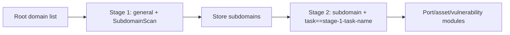

---

## name: scopesentry-mcp
description: Use ScopeSentry MCP to manage a security-scanning platform (projects, tasks, templates, assets, and nodes). Use this skill when the user mentions ScopeSentry, MCP, API keys, scan tasks, or asset queries.

# ScopeSentry MCP User Guide

For users of a **deployed ScopeSentry instance**. Connect to the platform through Cursor (or another MCP client); no local source code is required.

## 1. Preparation

### 1.1 Confirm service accessibility

- Default Web interface: `http://<host>`
- MCP endpoint: `http://<host>/mcp` (if a reverse proxy or front-end proxy is in front, use the actual `/mcp` address)

### 1.2 Create an API Key

1. Sign in to the ScopeSentry Web interface in a browser.
2. Open the **API Key** management page and create a key (or use the creation endpoint provided by an administrator).
3. Save the returned `ssk_...` string (**it is shown only once**).

### 1.3 Configure Cursor MCP

Cursor → Settings → MCP → Add server:

```json
{
  "mcpServers": {
    "scopesentry": {
      "url": "http://<your-host>:8082/mcp",
      "headers": {
        "X-API-Key": "ssk_your-api-key"
      }
    }
  }
}
```

You can also use: `Authorization: Bearer ssk_your-api-key`

After configuration, restart MCP or reload Cursor, and confirm that tools such as `list_projects` and `list_assets` appear in the tool list.

---

## 2. Tools at a glance


| Tool                     | Purpose                |
| ---------------------- | ----------------- |
| `list_projects`        | Project tree grouped by tags (including project IDs) |
| `list_projects_data`   | Paginated project list with name search     |
| `get_project`          | Project details              |
| `create_project`       | Create a project              |
| `list_tasks`           | Scan-task list            |
| `get_task`             | Task details              |
| `list_scan_templates`  | Scan-template list            |
| `get_scan_template`    | Template details              |
| `list_plugin_modules`  | Scan-pipeline module names          |
| `list_plugins`         | Available plugins (including hashes and default parameters) |
| `create_scan_template` | Create a scan template            |
| `create_scan_task`     | Create a scan task            |
| `list_assets`          | Query different asset types (paginated list)       |
| `count_assets`         | Count assets (`/api/assets/common/total`) |
| `get_asset_detail`     | Asset or vulnerability details           |
| `add_asset_tag`        | Add a tag to an asset           |
| `list_nodes`           | Scan-node list            |


Use the MCP tool descriptions (schemas) as the authority for tool parameters. `list_assets` and `count_assets` use the same search and filter syntax; before querying assets, you can read the `list_assets` description.

When you need to know the total number of items, use `count_assets` (the Web pagination total endpoint) instead of repeatedly paging through `list_assets` just to count the results.

---

## 3. Common workflows

### 3.1 Query assets by project

When the user or context **already has a project condition**, prefer passing `filter.project` to narrow the scope and avoid responses containing too much cross-project data. If no project is specified, adding a project filter is not mandatory.

1. Use `list_projects` or `list_projects_data` to obtain the target project's **ObjectID** (`id` / `children[].value`).
2. Pass `filter.project` to `list_assets` (**it must be an ID, not the displayed project name**).

```json
{
  "asset_type": "asset",
  "pageIndex": 1,
  "pageSize": 20,
  "search": "domain=^example.com",
  "filter": {
    "project": ["<project-object-id>"]
  }
}
```

### 3.2 Create a scan task

1. Use `list_nodes` to obtain the names of online nodes.
2. Use `list_scan_templates` or `create_scan_template` to obtain the template **ObjectID**.
3. In `create_scan_task`, `name` and `node` are required; set `template` to the template ID (not the template name).

**Target source `targetSource` (consistent with the Web client):**

| targetSource | Meaning | Required parameters |
| --- | --- | --- |
| `general` | Enter targets directly | `target` |
| `project` | Read targets from a project | `project` (project ObjectID array) |
| `asset` | Search the Web asset store | `search`; optional `project`, `filter`, `targetNumber` |
| `RootDomain` | Search the root-domain store | `search`; optional `project`, `filter`, `targetNumber` |
| `subdomain` | Search the subdomain store | `search`; optional `project`, `filter`, `targetNumber` |
| `UrlScan` | Search URL-scan results | `search`; optional `project`, `filter`, `targetNumber` |
| `*Source` (such as `subdomainSource`) | Create from assets “selected/searched” on the asset page | Use `search` when `targetTp=search`; use `targetIds` when `targetTp=select` |

**Example — scan root domains directly:**

```json
{
  "name": "example-subdomain-collection",
  "node": ["node-1"],
  "template": "<template-object-id>",
  "targetSource": "general",
  "target": "example.com\nfoo.com",
  "project": ["<project-object-id>"]
}
```

**Example — continue scanning from the subdomain store (filtered by the previous task name):**

```json
{
  "name": "example-ports-and-vulnerabilities",
  "node": ["node-1"],
  "template": "<follow-up-module-template-object-id>",
  "targetSource": "subdomain",
  "search": "task==\"example-subdomain-collection\"",
  "project": ["<project-object-id>"]
}
```

### 3.3 Complete root-domain information collection (recommended two stages)

When the input is **root domains** and you need **complete information collection**, split the work into two scans instead of running the entire pipeline at once.

**Reason:** Distributed tasks are dispatched by **individual target**. When a root domain is assigned to a node, subdomains discovered on that node also continue to run later modules there, which can cause uneven load, slow execution, and errors.

**Best practice:**

1. **Stage 1 — subdomain collection only**
   - `targetSource`: `general`
   - `target`: all root domains (one per line)
   - Template: enable only `SubdomainScan` and `SubdomainSecurity` (subdomain scanning + subdomain takeover)
   - Use `get_task` and wait for the task to complete

2. **Stage 2 — subsequent modules**
   - `targetSource`: `subdomain`
   - `search`: `task=="<stage-1 task name>"` (exact task-name match)
   - Optionally use `project` to narrow the scope
   - Template: port scanning, asset mapping, vulnerability scanning, and other modules (it may omit `SubdomainScan`)
   - Subdomains are dispatched to nodes as independent targets, making parallel execution more efficient

You can also filter by task name on the Web “subdomain” asset page and use “Create task from subdomains”; the result is the same.



### 3.4 Create a scan template

1. `list_plugin_modules` → module-name list
2. `list_plugins` (optionally filter by `module`) → each plugin's `hash` and default `parameter`
3. `create_scan_template`: use `modules` to specify a “module → plugin hash array” mapping

---

## 4. Asset queries (`list_assets` / `count_assets`)

`count_assets` and `list_assets` use the same `asset_type`, `search`, and `filter`, and return `{ "total": N }`, corresponding to the Web endpoint `/api/assets/common/total`.

```json
{
  "asset_type": "subdomain",
  "search": "task==\"some-task-name\"",
  "filter": {"project": ["<project-object-id>"]}
}
```

**Performance recommendations (common to `list_assets` / `count_assets`):** When a project condition exists, prefer `filter.project` to narrow the scope. For indexed fields in `search`, prefer `==` exact matching or `^` prefix matching (see [4.3](#43-search-expression)), and avoid broad `=` fuzzy queries that slow responses. When no project context exists, adding a project filter is not mandatory.

See the [4.4](#44-exact-filter) table for the types that support `filter.project`.

### 4.1 Asset type `asset_type`

`asset`, `RootDomain`, `subdomain`, `app`, `mp`, `UrlScan`, `SensitiveResult`, `DirScanResult`, `crawler`, `vulnerability`, `PageMonitoring`, `IPAsset`, `SubdomainTakerResult`

Alias examples: `web`→asset, `vuln`→vulnerability, `ip`→IPAsset, `url`→UrlScan

### 4.2 Parameter descriptions


| Parameter                       | Description                                      |
| ------------------------ | --------------------------------------- |
| `pageIndex` / `pageSize` | Pagination; defaults to 1 / 20                            |
| `search`                 | Search expression (see the next section)                              |
| `filter`                 | Exact filter JSON (see the next section)                          |
| `sort`                   | Only UrlScan and DirScanResult support sorting by `length` |
| `sid`                    | SensitiveResult only: sensitive-rule name                |


`search` and `filter` **can be used together**.

### 4.3 Search expression

Custom DSL (**not SQL**):


| Operator  | Meaning   | Index | Example                          |
| ---- | ---- | ---- | --------------------------- |
| `=`  | Fuzzy match (regex) | Not used | `domain=example`            |
| `==` | Exact match | **Used** | `port==443`                 |
| `!=` | Exclude   | — | `port!="80"`                |
| `&&` | And    | — | `domain==example.com && port==443` |
| `||` | Or    | — | `title=admin || body=login` |


**Indexes and operators:** Fields such as `domain`, `ip`, `port`, and `title` are indexed, but the index is used only for **`==` exact matches** or **prefix matching with a value that starts with `^`** (for example, `domain=^example.com`). **`=` is converted to a fuzzy regex match and cannot use the index**, so it can become slow with large data volumes.

**Search fields common to all types:** `tag`, `task` (task name), and `rootDomain`

**Do not put `project` in `search`** (it is invalid or causes an error when combined with `&&`). Use `filter.project` to filter by project.

**Common search fields by type:**


| asset_type           | Fields                                                                                  |
| -------------------- | ----------------------------------------------------------------------------------- |
| asset                | domain, ip, port, service, app, title, statuscode, icon, banner, type, body, header |
| RootDomain           | domain, icp, company                                                                |
| subdomain            | domain, ip, type, value                                                             |
| app                  | name, icp, company, category, description, url, apk                                 |
| mp                   | name, icp, company, category, description, url                                      |
| UrlScan              | url, input, source, resultId, type                                                  |
| SensitiveResult      | url, sname, body, info, md5                                                         |
| DirScanResult        | url, statuscode, redirect, length                                                   |
| vulnerability        | url, vulname, matched, request, response, level                                     |
| crawler              | url, method, body, resultId                                                         |
| PageMonitoring       | url, hash, diff, response                                                           |
| IPAsset              | ip, domain, port, service, webServer, app                                           |
| SubdomainTakerResult | domain, value, type, response                                                       |


**Search examples:**

- `domain==www.example.com && port==443` (exact match; uses the index)
- `domain=^example.com` (prefix match; uses the index)
- `ip==192.168.1.1`
- `task=="some-task-name"`
- `level==high` (vulnerability)
- `statuscode==200` (DirScanResult)

Use `=` only when a fuzzy containment match is needed, for example `title=admin` (does not use the index; narrow the scope with a project or other conditions where appropriate).

### 4.4 Exact `filter`

JSON object: multiple values for the same key are **OR**; different keys are **AND**.

**When a project condition exists, prefer `project`:** If the user or context has already specified a project and the `asset_type` supports `project`, include it to narrow the scope. When no project information exists, it is not mandatory.


| filter key   | Meaning        | Value description                                                     |
| ------------ | -------- | -------------------------------------------------------- |
| `project`    | Owning project     | **ObjectID**; obtain it with `list_projects` / `list_projects_data` |
| `task`       | Source task     | **Task name**; use the `name` from `list_tasks`                         |
| `port`       | Port       | Such as `"443"`                                                |
| `service`    | Service/protocol    | Such as `"https"`                                              |
| `app`        | Application fingerprint     | Such as `"Nginx"`                                              |
| `icon`       | Icon hash  |                                                          |
| `statuscode` | HTTP status code | Mainly for asset                                               |
| `status`     | Status       | UrlScan/DirScan HTTP code; vulnerability/sensitive-information processing status                       |
| `level`      | Vulnerability level     | critical / high / medium / low / info                    |
| `type`       | Type       | Such as subdomain record types A and CNAME                                         |
| `color`      | Sensitive-rule color   | SensitiveResult                                          |
| `sname`      | Sensitive-rule name    | SensitiveResult                                          |
| `tags`       | Tags       |                                                          |


**Available filter keys by type:**


| asset_type                            | filter key                                                      |
| ------------------------------------- | --------------------------------------------------------------- |
| asset                                 | project, port, service, app, icon, statuscode, type, task, tags |
| RootDomain                            | project, tags                                                   |
| subdomain                             | project, type, task, tags                                       |
| app / mp                              | project, tags                                                   |
| UrlScan                               | status, tags                                                    |
| DirScanResult                         | status, tags                                                    |
| SensitiveResult                       | status, color, sname, tags                                      |
| crawler                               | project, task, tags                                             |
| vulnerability                         | project, level, status, task, tags                              |
| PageMonitoring / SubdomainTakerResult | tags                                                            |
| IPAsset                               | project, port, service, app                                     |


**Filter example:**

```json
{"project": ["<project-object-id>"], "port": ["443"]}
```

**Combined-query example:**

```json
{
  "asset_type": "asset",
  "search": "domain=^baidu && port==443",
  "filter": {"project": ["<project-object-id>"]},
  "pageIndex": 1,
  "pageSize": 10
}
```

**Notes:**

- When a project condition exists, prefer `filter.project` (when supported); without project context, it is not mandatory.
- Do not put the displayed project name in `filter.project`.
- Use `==` for known values and `^` for prefixes; avoid overusing `=` fuzzy matching on large tables.
- Use `filter.status` for the HTTP status of UrlScan; DirScanResult can use `statuscode==200` in `search`.
- For SensitiveResult, filter by rule name with `sname=rule-name` in `search`, or with `filter.sname`.

### 4.5 Sorting `sort`

Only **UrlScan** and **DirScanResult** support it:

```json
{"length": "ascending"}
```

Other types ignore `sort` and use the default time ordering.

---

## 5. Scan-template module names

`TargetHandler`, `SubdomainScan`, `SubdomainSecurity`, `PortScanPreparation`, `PortScan`, `PortFingerprint`, `AssetMapping`, `AssetHandle`, `URLScan`, `WebCrawler`, `URLSecurity`, `DirScan`, `VulnerabilityScan`, `PassiveScan`

---

## 6. Troubleshooting


| Symptom        | Action                                                 |
| --------- | -------------------------------------------------- |
| No MCP tools   | Check the URL, API Key, and whether ScopeSentry is running                    |
| 401 / 403 | Recreate or replace the API Key                                    |
| Asset not found     | Confirm that `filter.project` is an ObjectID; do not put `project` in `search` |
| Template/task creation fails | `template` must be a template ObjectID; `node` must be an online node name            |
| Query is slow/stuck   | When a project is available, add `filter.project`; for indexed fields use `==` or the `^` prefix in `search`, use `=` less often; reduce `pageSize` |


---
